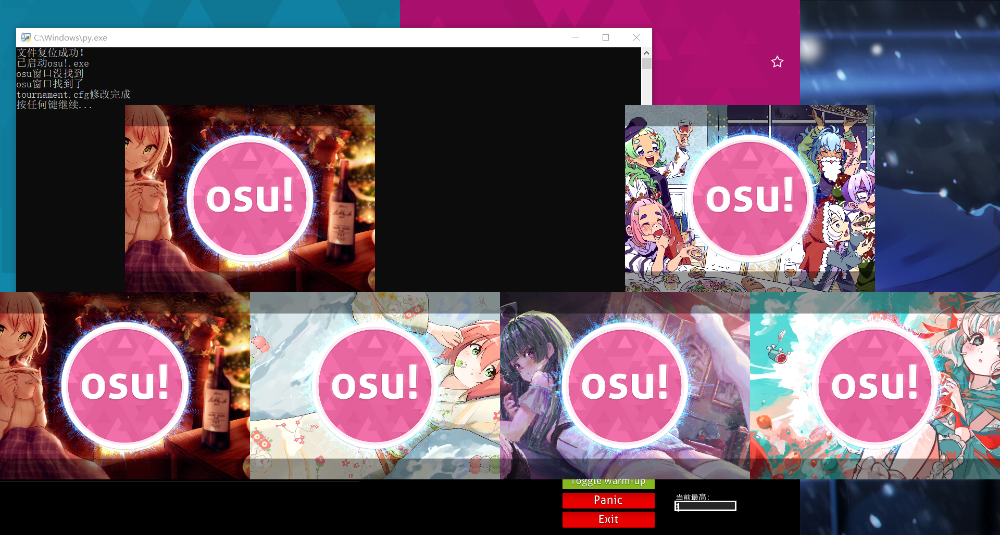

本脚本可以让1080p屏幕下的用户使用标准的1080p osu!旧版比赛端画面，而控制面板按钮不错位（通常1080P屏幕只能开启864P的画面，比较糊且直接修改Height为1080会导致按钮错位）  
原理就是osu比赛端会不停地读tournament.cfg这个文件，这个程序可以在Tournament Manager启动时立即修改tournament.cfg文件以达到修改1080p画面的效果（如下图所示）  
  
理论上你也可以通过修改参数获得更佳高清的比赛端画面（只要你电脑性能够好）  
Windows 8及以上 Only（因为win8及以上才有多桌面，如果你是多屏用户请忽视这条）  
此程序由Copilot生成  
初次使用请安装python，如果安装了就无需安装  
需要手动编辑.py文件里面的osu文件路径，注意看注释  
如果安装依赖失败请手动在cmd里输入  
pip install pywin32  
关于osu比赛端如何使用，请参阅[https://osu.ppy.sh/wiki/zh/osu!_tournament_client/osu!tourney/Setup  ](https://osu.ppy.sh/wiki/zh/osu%21_tournament_client/osu%21tourney)  
